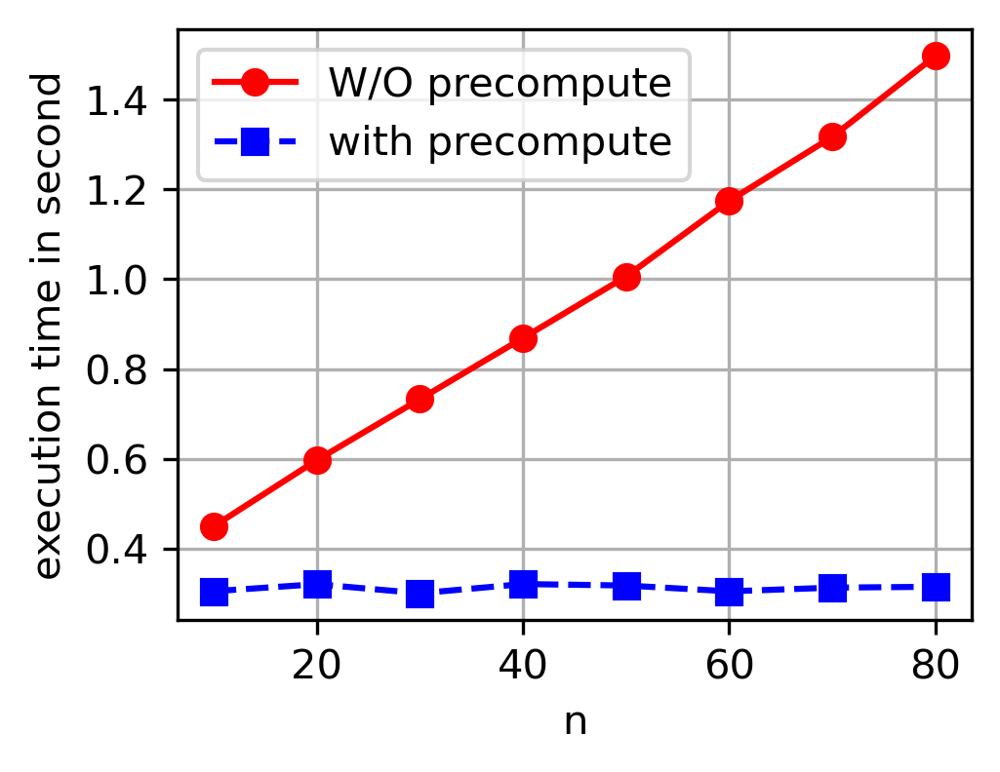
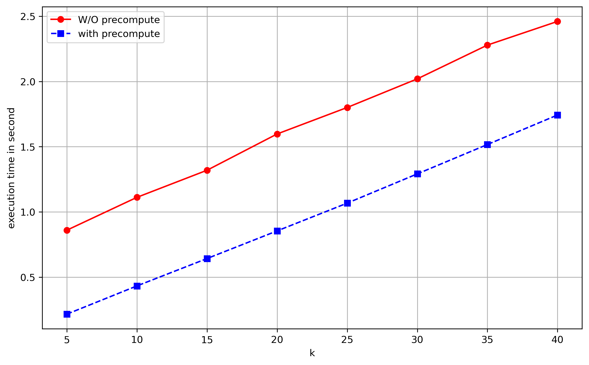
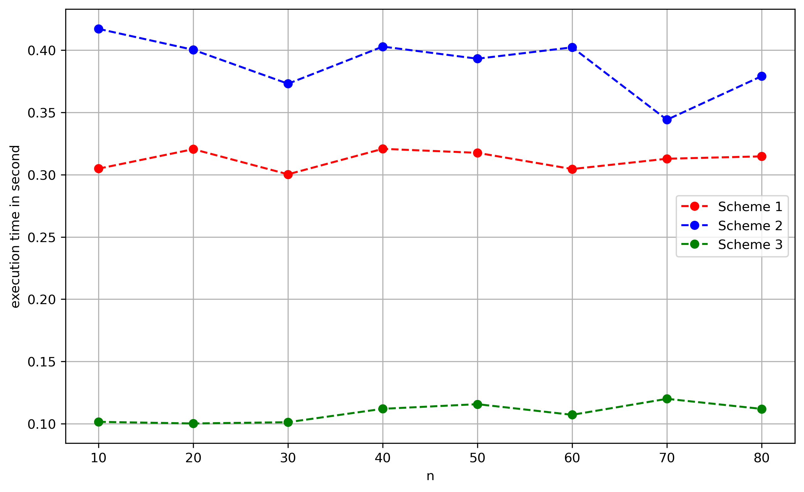
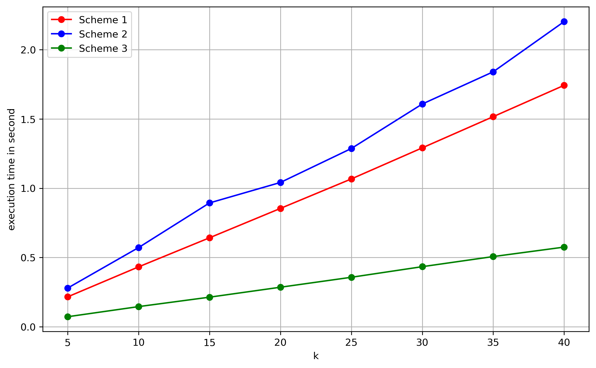

# Efficient Pairing-Free Adaptable k-out-of-N Oblivious Transfer Protocols

## Overview
This repository is intended to host the implementations of three **k-out-of-N Oblivious Transfer** schemes introduced in the paper titled "Efficient Pairing-Free Adaptable k-out-of-N Oblivious Transfer Protocols". You can access the ePrint IACR version of the paper [here](https://eprint.iacr.org/2024/1583).

## Abstract
Oblivious Transfer (OT) is a crucial building block in cryptography that enables a variety of privacy-preserving applications. We propose three efficient two-round pairing-free k-out-of-N OT protocols with standard security that do not rely on costly pairings, making them suitable for resource-constrained devices. Our constructions support adaptivity and offline encryption, making them advantageous for one-sender-multiple-receiver scenarios. The protocols are proven secure under the Computational Diffie-Hellman (CDH) and RSA assumptions.

## Features
- **Pairing-free constructions**: Eliminates costly pairing operations, making them efficient.
- **Adaptivity support**: The receiver can sequentially execute the protocol to retrieve different messages.
- **Offline encryption**: The sender can precompute encryptions of messages independent of the receiver's variables.
- **Standard model security**: The protocols are secure under standard cryptographic assumptions (CDH, RSA).

## Schemes

### 1. **Discrete Logarithm Based Scheme**
- A two-round protocol using multiplicative group arithmetic.
- Achieves sender’s offline encryption capability and minimal data transfer.

### 2. **Elliptic Curve Based Scheme**
- Employs elliptic curve arithmetic for efficient computation and transmission.
- Well-suited for resource-constrained environments.

### 3. **RSA Based Scheme**
- Leverages the computational hardness of RSA and provides a compact structure.
- Supports adaptivity and efficient decryption.

## Performance Evaluation
The schemes have been evaluated based on the following criteria:
- **Communication Complexity**: Measured by the number of group elements transmitted.
- **Computational Efficiency**: Analysis based on modular exponentiations and group multiplications.
- **offline Vs online model**: Performance comparison between precomputation (offline) and real-time (online) execution models.

The implementation was performed in Python using the GMPY2 library for efficient arithmetic operations and SageMath for cryptographic computations. Below are the results for 1,000 runs of 7-out-of-45 OT:

| Scheme         | Without Precomputation | With Precomputation |
|----------------|------------------------|---------------------|
| **Scheme 1**   | 0.9529 seconds         | 0.3096 seconds      |
| **Scheme 2**   | 1.2309 seconds         | 0.4092 seconds      |
| **Scheme 3**   | 0.7922 seconds         | 0.1018 seconds      |

### Figures
1. **Figure 1**: 
2. **Figure 2**: 
3. **Figure 3**: 
4. **Figure 4**: 
   

## Citation
If you find our work useful in your research, please cite:

```bibtex
@misc{cryptoeprint:2024/1583,
  author       = {Keykhosro Khosravani and Taraneh Eghlidos and Mohammad Reza Aref},
  title        = {Efficient Pairing-Free Adaptable k-out-of-N Oblivious Transfer Protocols},
  howpublished = {Cryptology ePrint Archive, Paper 2024/1583},
  year         = {2024},
  url          = {https://eprint.iacr.org/2024/1583}
}
```

## Contributors
- **Keykhosro Khosravani** 
- **Taraneh Eghlidos**
- **Mohammad Reza Aref**

